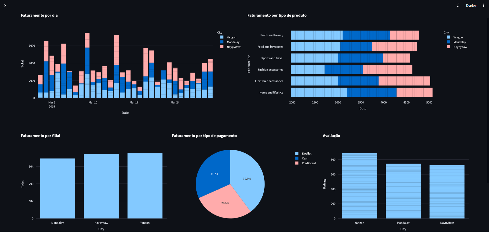

## Dashboard de Vendas do Supermercado.

Este projeto consiste em um dashboard interativo criado com o Streamlit e Plotly para análise de dados de vendas de um supermercado. O dashboard permite aos usuários explorarem o faturamento, avaliações e outros indicadores importantes por mês, cidade e categoria de produtos.

### Funcionalidades do Dashboard
- Faturamento por dia: Visualize o total de vendas diário separado por filial.

- Faturamento por tipo de produto: Identifique as linhas de produtos mais vendidas.

- Faturamento por filial: Compare o desempenho das diferentes filiais.

- Distribuição por tipo de pagamento: Veja as contribuiçõesS de cada método de pagamento.

- Avaliações por filial: Analise a média de avaliações das filiais pelos clientes.

### 🖥️ Instalação

1. Clone este repositório
```bash
git clone https://github.com/matheusmatosr/dashboard_mercado.git
```

Abra o terminal e faça os seguintes códigos:
  
2. Para instalar as dependências

```bash
pip install streamlit pandas plotly
```

3. Para rodar o projeto:

```bash
streamlit run dashboard.py
```

Acesse o dashboard no navegador pelo link gerado no terminal (geralmente http://localhost:8501).

